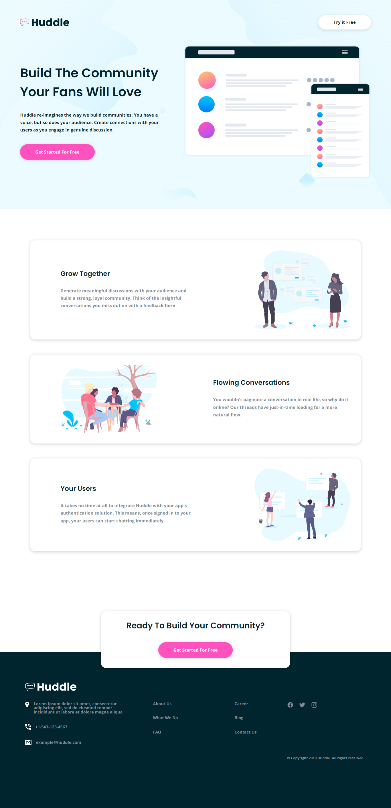

# Huddle landing page with alternating feature blocks solution

This is a solution to the [Huddle landing page with alternating feature blocks challenge on Frontend Mentor](https://www.frontendmentor.io/challenges/huddle-landing-page-with-alternating-feature-blocks-5ca5f5981e82137ec91a5100)

## Table of contents

- [Screenshot](#screenshot)
- [Links](#links)
- [Built with](#built-with)
- [Useful resources](#useful-resources)
- [Author](#author)

### Screenshot

### Links

- Live Site URL: [Add live site URL here](https://huddle-landing-page-karim.netlify.app/)

### Built with

- Semantic HTML5
- CSS

### Useful resources

- [ionicons](https://ionic.io/ionicons)
- [Tint and Shade Generator](https://maketintsandshades.com/)

## Author

- Linkedin - [Karim Ashraf](https://www.linkedin.com/in/karim-ashraf-72k/)
